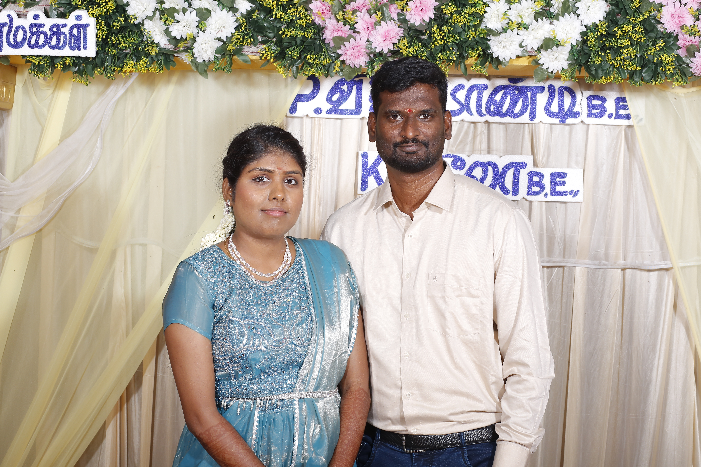

# 📸 Moments Captured - Professional Photography Website

A modern, fully responsive photography & event management website built with HTML, CSS, and JavaScript. Perfect for showcasing your photography portfolio and managing client inquiries.

## ✨ Features

### 🎨 **Beautiful Design**
- Modern gradient color scheme (Gold, Dark Blue, Red accents)
- Fully responsive (mobile, tablet, desktop)
- Smooth animations and transitions
- Professional typography and spacing

### 📸 **Interactive Gallery**
- Click to view photos in full-screen lightbox
- Filter photos by category (Weddings, Birthdays, Housewarmings, Baby Showers, Corporate)
- Navigate with arrow buttons or keyboard arrows
- Zoom and smooth transitions

### 📋 **Complete Sections**
- **Home** - Eye-catching hero banner
- **Why Choose Us** - 4 feature highlights
- **Gallery** - 10 sample photos with filtering
- **Services** - 6 service packages with pricing
- **Testimonials** - Client reviews
- **Contact Form** - Enquiry form with all necessary fields
- **Footer** - Complete site navigation and social links

### 🔧 **User-Friendly Features**
- Responsive mobile menu (hamburger)
- Smooth scrolling navigation
- Contact form with validation
- Lightbox keyboard navigation (arrows + Escape)
- Form submission via email
- Fast loading times

---

## 🚀 Quick Start (2 Minutes)

### **Option 1: Deploy on Netlify (Easiest)**

1. **Download** the 3 files:
   - `index.html`
   - `style.css`
   - `script.js`

2. **Create a GitHub Repository:**
   ```bash
   # Go to github.com and create new repo named "photography-website"
   # Clone it locally
   git clone https://github.com/YOUR-USERNAME/photography-website.git
   cd photography-website
   ```

3. **Copy Files:**
   ```bash
   # Copy the 3 downloaded files into this folder
   # Then push to GitHub
   git add .
   git commit -m "Add photography website"
   git push origin main
   ```

4. **Deploy on Netlify:**
   - Go to **[netlify.com](https://netlify.com)**
   - Click **"New site from Git"**
   - Select your GitHub repository
   - Click **"Deploy"**
   - ✅ Your site is LIVE!

### **Option 2: Run Locally (For Testing)**

1. **Download the files**

2. **Open in your browser:**
   ```bash
   # Simply double-click index.html
   # OR open folder with VS Code and use "Live Server" extension
   ```

3. **Test locally:**
   - Open `http://localhost:5500` (if using Live Server)
   - Click gallery photos to test lightbox
   - Fill form to test submission
   - Test on mobile using browser DevTools (F12 → Toggle Device Toolbar)

---

## 📁 Project Structure

```
photography-website/
├── index.html          # Main HTML file (all content & sections)
├── style.css           # All styling (colors, fonts, layouts)
├── script.js           # All interactivity (gallery, forms, animations)
└── README.md           # This file
```

### **Optional: Adding Your Photos**

```
photography-website/
├── index.html
├── style.css
├── script.js
└── images/
    └── gallery/
        ├── wedding-01.jpg
        ├── wedding-02.jpg
        ├── birthday-01.jpg
        ├── birthday-02.jpg
        └── ... (your photos)
```

---

## 🎨 Customization Guide

### **1. Change Business Name & Contact Info**

In **index.html**, find and update:

**Line ~20 (Page Title):**
```html
<title>Moments Captured - Professional Photography & Event Management</title>
```

**Line ~50 (Logo):**
```html
<span class="logo-text">Moments Captured</span>
```

**Line ~480-495 (Contact Section):**
```html
<p>contact@momentscaptured.com</p>  <!-- Your email -->
<p>+91 9876543210</p>               <!-- Your phone -->
<p>Puducherry, India</p>            <!-- Your location -->
```

### **2. Change Colors**

In **style.css**, line 8:

```css
:root {
  --primary: #D4AF37;      /* Gold - Change to your color */
  --secondary: #2c3e50;    /* Dark Blue - Change to your color */
  --accent: #e74c3c;       /* Red - Change to your color */
  --light: #ecf0f1;        /* Light gray */
  --dark: #1a1a1a;         /* Very dark */
  --white: #ffffff;        /* White */
  --gray: #95a5a6;         /* Medium gray */
}
```

**Example: Change to Purple theme**
```css
--primary: #9b59b6;        /* Purple */
--secondary: #2c3e50;      /* Keep dark */
--accent: #3498db;         /* Blue */
```

### **3. Update Service Prices**

In **index.html**, find the Services section (~line 280):

```html
<p class="service-price">₹20,000 - ₹50,000</p>  <!-- Update this -->
<p class="service-duration">Full day coverage</p>
```

### **4. Add Your Photos**

Replace the Unsplash URLs in **index.html** (~line 140):

**Before (using free stock photos):**
```html

```

**After (using your photos):**
```html

```

### **5. Update Social Links**

In **index.html**, Footer section (~line 520):

```html
<a href="https://facebook.com/yourpage" target="_blank">Facebook</a>
<a href="https://instagram.com/yourprofile" target="_blank">Instagram</a>
<a href="https://youtube.com/yourchannel" target="_blank">YouTube</a>
```

### **6. Modify Service Descriptions**

In **index.html**, Services section (~line 260-330):

Find the service card and update:
```html
<h3>Wedding Photography</h3>
<p>Your description here...</p>
<p class="service-price">Your price here</p>
```

---

## 💬 Contact Form Setup

### **Option 1: Email (Default - Already Works!)**

The form sends via mailto. Users will click "Send Inquiry" and their email client opens.

### **Option 2: Formspree (Recommended - Pro Setup)**

1. Go to **[formspree.io](https://formspree.io)**
2. Sign up (free)
3. Create a new form
4. Copy your form ID
5. In **index.html**, line ~435, update:

```html
<!-- BEFORE -->
<form class="contact-form" id="contactForm" onsubmit="handleFormSubmit(event)">

<!-- AFTER (with Formspree) -->
<form class="contact-form" action="https://formspree.io/f/YOUR_FORM_ID" method="POST">
```

6. Replace `YOUR_FORM_ID` with your actual Formspree ID

---

## 📱 Testing Checklist

Before going live, test:

- [ ] **Desktop** - Full browser, all features work
- [ ] **Mobile** - Hamburger menu works, layout responsive
- [ ] **Gallery** - Click photos, lightbox opens, navigation works
- [ ] **Filters** - Click category buttons, photos filter correctly
- [ ] **Contact Form** - Fill form, submit works
- [ ] **Links** - All navigation links scroll smoothly
- [ ] **Keyboard** - Arrow keys work in lightbox, Escape closes it
- [ ] **Mobile Menu** - Hamburger menu toggles on small screens

---

## 🔒 Important Notes

### **Images**
- Using free Unsplash images by default
- Replace with your own photos for professional look
- Keep image sizes: **1200x800px or larger**
- Optimize for web: **compress before uploading**

### **Contact Email**
- Update `contact@momentscaptured.com` to your email
- Users' submissions will open their email client
- For automatic email delivery, use Formspree

### **SEO**
- Update `<meta name="description">` (line 7) with your description
- Update `<meta name="keywords">` (line 8) with your keywords
- Add your business name everywhere

---

## 🚀 Deployment Steps (Detailed)

### **Step 1: Prepare Your Files**
```bash
cd your-project-folder
# Make sure you have:
# - index.html
# - style.css  
# - script.js
# - images/ (optional, if using your photos)
```

### **Step 2: Create GitHub Repository**
```bash
git init
git add .
git commit -m "Initial commit: Photography website"
```

### **Step 3: Push to GitHub**
- Create repo on **github.com**
- Push your code:
```bash
git remote add origin https://github.com/YOUR-USERNAME/photography-website.git
git branch -M main
git push -u origin main
```

### **Step 4: Deploy on Netlify**
1. Go to **[netlify.com](https://netlify.com)**
2. Click **"New site from Git"**
3. Connect GitHub (authorize Netlify)
4. Select your repository
5. Click **"Deploy site"**
6. Wait 2-3 minutes...
7. ✅ Your site is live at: `https://your-site-name.netlify.app`

### **Step 5: Get Custom Domain (Optional)**
- Netlify → Site settings → Domain management
- Add your custom domain (costs $12-15/year)

---

## 🔧 Troubleshooting

### **Photos not showing?**
- Check file paths match exactly
- Make sure image files are committed to GitHub
- Use absolute URLs if relative paths don't work
- Check browser console (F12) for 404 errors

### **Form not sending?**
- Check email address in HTML
- Test in different browsers
- Make sure JavaScript is enabled
- Try Formspree integration

### **Site looks broken on mobile?**
- Open DevTools (F12)
- Toggle device toolbar
- Check responsive mode for 375px width
- All elements should reflow properly

### **Lightbox not working?**
- Check browser console for JavaScript errors
- Make sure script.js is loaded
- Try different browser
- Clear cache and reload

### **Styling looks off?**
- Clear browser cache (Ctrl+Shift+Delete)
- Hard reload (Ctrl+Shift+R)
- Check CSS file is linked in HTML
- Validate CSS syntax

---

## 📚 File Details

### **index.html (~570 lines)**
- HTML5 structure
- All sections: Home, Gallery, Services, Contact, Footer
- Mobile meta viewport
- SEO meta tags
- External CSS & JS links

### **style.css (~800 lines)**
- CSS Grid & Flexbox layouts
- Mobile-first responsive design
- Color variables (easy customization)
- Animations & transitions
- Media queries for 768px and 480px breakpoints

### **script.js (~250 lines)**
- Gallery filtering logic
- Lightbox modal functionality
- Navigation menu toggle
- Contact form handling
- Smooth scroll functionality
- Keyboard event listeners

---

## 🎓 Learning Resources

- **HTML** - [MDN Web Docs](https://developer.mozilla.org/en-US/docs/Web/HTML)
- **CSS** - [CSS-Tricks](https://css-tricks.com)
- **JavaScript** - [JavaScript.info](https://javascript.info)
- **Responsive Design** - [Web.dev Responsive Design](https://web.dev/responsive-web-design-basics/)
- **Git/GitHub** - [GitHub Guides](https://guides.github.com)
- **Netlify** - [Netlify Docs](https://docs.netlify.com)

---

## 💡 Enhancement Ideas

### **Future Features You Can Add:**
1. **Blog Section** - Add photography tips/articles
2. **Video Gallery** - Embed wedding videos/reels
3. **Booking System** - Integration with calendar
4. **Payment Integration** - Stripe/Razorpay for online payment
5. **CMS Backend** - Headless CMS for easy updates
6. **Newsletter** - Email subscription form
7. **Reviews/Ratings** - Google reviews integration
8. **Photo Download** - Password-protected galleries

---

## 📞 Support & Questions

### **Common Issues:**

**Q: How do I use my own domain?**
A: Buy domain (GoDaddy, Namecheap), connect to Netlify in Site Settings → Domain Management

**Q: Can I add a blog section?**
A: Yes! Create new section in HTML, style with CSS, add JavaScript for filtering

**Q: How do I handle payments?**
A: Add Razorpay or Stripe integration in JavaScript for online bookings

**Q: Can I make this a PWA (mobile app)?**
A: Yes! Add manifest.json and service worker for installable app

---

## 📝 License

This project is free to use for personal and commercial purposes.

---

## 🎯 Quick Checklist Before Launch

- [ ] Updated business name throughout
- [ ] Changed contact email & phone
- [ ] Updated service prices
- [ ] Added your own photos
- [ ] Changed colors to match brand
- [ ] Updated social media links
- [ ] Tested all features (desktop & mobile)
- [ ] Deployed to Netlify
- [ ] Set up custom domain
- [ ] Tested contact form
- [ ] SEO meta tags updated
- [ ] Mobile menu works
- [ ] Gallery filters work
- [ ] Lightbox functions perfectly
- [ ] No console errors (F12)

---

## ✅ You're All Set!

Your photography website is ready to go live! 🚀

1. **Customize** - Update colors, text, and photos
2. **Test** - Check everything works on mobile
3. **Deploy** - Push to GitHub and connect to Netlify
4. **Share** - Tell your clients about your new site!

---

**Built with ❤️ for photographers**

Need help? Check the troubleshooting section above or customize the code to fit your needs!

---

**Version:** 1.0  
**Last Updated:** June 2024  
**Compatibility:** All modern browsers, mobile responsive
